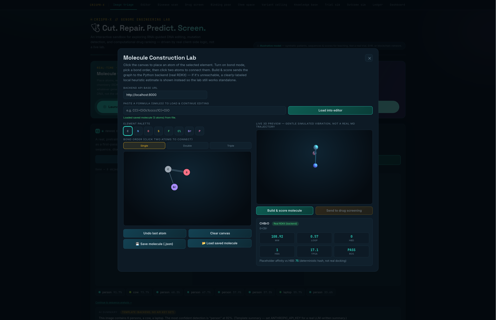
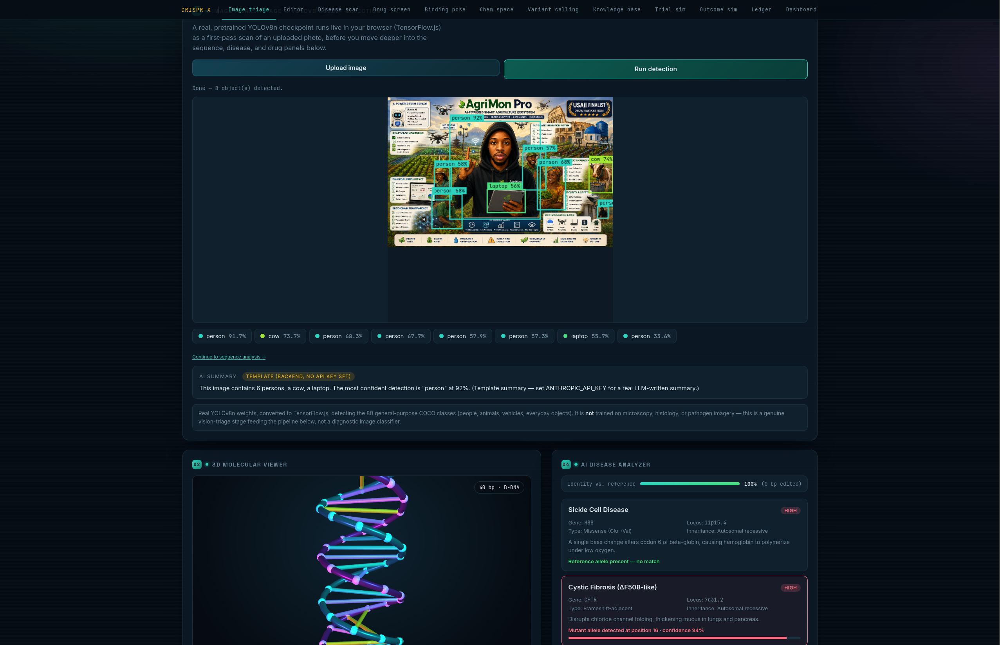

# CRISPR-X — Full-Stack Architecture

An educational genome-engineering + drug-discovery platform: interactive
CRISPR editing, disease mutation scanning, AI-assisted drug screening, a
real-time molecule construction lab, clinical trial + survival simulation,
and a tamper-evident audit ledger — split into a proper `backend/` (Python,
FastAPI, MCP, real chemistry via RDKit, optional Hedera integration) and
`frontend/` (the original interactive app, unchanged).





```
src/
├── backend/
│   ├── app/
│   │   ├── main.py              # FastAPI REST API
│   │   ├── mcp_server.py        # MCP server (12 tools) — same logic, agent-callable
│   │   ├── config.py
│   │   ├── data/                # reference sequence, disease table, compound SMILES, synthetic generators
│   │   └── services/            # genome editing, disease scan, drug scoring, molecule lab,
│   │                             # survival stats, hash-chain ledger, Hedera client
│   ├── tests/                   # pytest suite (9 tests, all passing)
│   ├── requirements.txt
│   ├── Dockerfile
│   ├── run.sh                   # one-command local start
│   └── .env.example
├── frontend/
│   └── index.html               # the full interactive app (byte-identical to the
│                                 # original artifact, plus one additive feature — see below)
├── docker-compose.yml
└── README.md                    # you are here
```

## What changed vs. what didn't

**Nothing in the original frontend was altered or removed.** The Molecule
Construction Lab and Image Triage panel were extended additively (all prior
behavior preserved):

- **Molecule Lab — paste a formula:** paste any SMILES string and it's parsed
  with the app's existing SMILES parser and laid out in 3D with the existing
  force-directed embedder (`embedLigand3D`, already used by the docking
  viewer) — then dropped straight into the editor so you can keep adding
  atoms/bonds on top of it.
- **Molecule Lab — live 3D:** the preview now has a gentle continuous
  vibration animation (explicitly labeled as stylized, not a real MD
  trajectory) so the structure feels alive while you work.
- **Molecule Lab — save/load:** "Save molecule" downloads your current
  atoms/bonds as a `.json` file; "Load saved molecule" reads one back in, so
  work can continue in a later session. No browser storage is used — it's a
  plain file, so it survives across machines and browsers.
- **Image triage — AI summary:** after YOLOv8 detection runs, the frontend
  calls the new `/api/vision/summarize` endpoint. With `ANTHROPIC_API_KEY` set
  on the backend, that's a real call to Claude describing the detections in
  plain language; without it, a deterministic template summary is shown
  instead — always labeled which one you're looking at.
- **CRISPR knowledge assistant:** the local RAG corpus was expanded from 15 to
  25 passages, adding real mechanistic detail (Cas1/Cas2 spacer acquisition,
  PAM structure, Chi-site self/non-self discrimination, Cas9's PI/HNH/RuvC
  domains, and the NHEJ/HDR repair pathways in more depth) — still local
  TF-IDF retrieval, not a generative model, just a richer knowledge base.

Everything else (3D DNA viewer, CRISPR simulator, disease analyzer, drug
screening, docking, chemical space, trial simulator, outcome simulator, audit
ledger, final dashboard) behaves exactly as before.


## Running it

### Frontend only (no backend, fastest)
Just open `frontend/index.html` in a browser. Every panel except the new
Molecule Lab's "real chemistry" mode works exactly as it did before — the lab
falls back to a local heuristic automatically.

### Full stack (frontend + backend)
```bash
cd backend
./run.sh
# → FastAPI on http://localhost:8000, interactive docs at /docs
```
Then open `frontend/index.html` and, inside the Molecule Lab, confirm the
"Backend API base URL" field points at `http://localhost:8000` (the default).

### Docker
```bash
docker compose up --build
# backend → http://localhost:8000
# frontend → http://localhost:8080
```
(Not build-tested in this environment — no Docker daemon/registry access here
— but it follows the standard FastAPI + static-nginx pattern.)

### Tests
```bash
cd backend
pip install -r requirements.txt
pytest tests/ -v
# 9 passed
```

### MCP server
```bash
cd backend
python3 -m app.mcp_server
```
Exposes 12 tools (sequence scanning, gRNA design, CRISPR repair, drug ranking,
molecule building, survival simulation, synthetic cohort generation, ledger
operations) over the Model Context Protocol, so any MCP-aware client — Claude,
another agent, or a custom orchestrat
or — can drive the platform directly
instead of only a human clicking through the UI.

## Technology actually used (and why)

| Layer | Technology | Real or illustrative? |
|---|---|---|
| Frontend rendering | HTML5, CSS3, vanilla JS, Three.js/WebGL | Real |
| Vision triage | TensorFlow.js + YOLOv8n | Real model, general-purpose COCO detection (not medical imaging) |
| Backend API | Python, FastAPI, Pydantic | Real |
| Chemistry | RDKit (descriptors + valence-validated molecule building) | Real computation on fictional/user-built molecules |
| Agent interface | MCP (`mcp` Python SDK, FastMCP) | Real, 12 tools verified to register |
| Audit trail | SHA-256 hash chain (Python `hashlib` / browser `crypto.subtle`) | Real hashing, local chain |
| Distributed ledger | Hedera Consensus Service (`hedera-sdk-py`) | Real SDK classes, **disabled until you supply testnet credentials** — see `.env.example` |
| Image AI summary | Anthropic API (`anthropic` SDK) | Real LLM call **if `ANTHROPIC_API_KEY` is set**, otherwise an honest template summary |
| Statistics | Kaplan-Meier estimator, log-rank test | Real methods, applied to **simulated** exponential survival times |
| Clinical data | Patient cohort, sequencing reads, disease table | **Synthetic** — no real patients, no PII, no ClinVar/OMIM/gnomAD lookups |
| Drug candidates | 8 fictional compounds with valid SMILES | Real RDKit descriptors, not existing approved drugs |
| "Binding affinity" | Deterministic hash-based placeholder | Illustrative only — not docking, not AlphaFold |

## Enabling real Hedera anchoring

The ledger works locally out of the box (see `backend/app/services/ledger_service.py`).
To have every block also get submitted as a real Hedera Consensus Service
message:

1. Create a free testnet account at https://portal.hedera.com
2. Copy `backend/.env.example` to `backend/.env` and fill in
   `HEDERA_ACCOUNT_ID` / `HEDERA_PRIVATE_KEY`
3. Call `POST /api/hedera/create-topic` once (or use the Hedera portal) to get
   a `HEDERA_TOPIC_ID`, then set that too
4. `GET /api/hedera/status` will report `configured: true`, and you can wire
   `ledger.append()` calls to also call `hedera_service.submit_ledger_block()`

This isn't wired to auto-fire on every append by default — that's a deliberate
choice so the backend never silently attempts (and fails) a real network call
without your explicit credentials in place.

## Honest limitations

This is a teaching/demo platform, not a clinical, wet-lab, or regulatory-grade
system. See the in-app "What's real vs. simplified here" panel for the full,
itemized accounting. In short: the code paths are genuine — real RDKit
chemistry, real statistics, a real MCP server, real (optional) Hedera SDK
calls — but the underlying data is synthetic and several components (disease
table, binding affinity, docking) are deliberately simplified stand-ins for
tools that would need real infrastructure (ClinVar/gnomAD access, AutoDock/
DiffDock, AlphaFold, a funded clinical trial) to be genuinely predictive.
